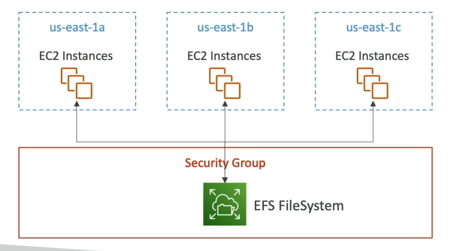
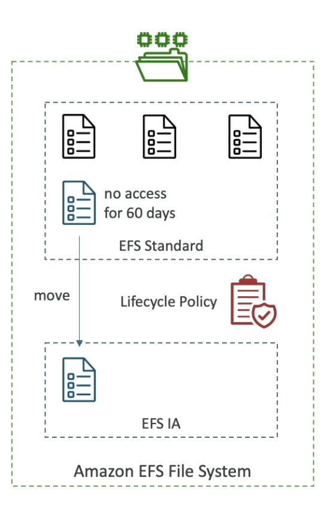

## EC2 Storage

We can connect different storages types on our ec2 instances: EBS (elastic block store) ans EFS (elastic file system).
They are useful in some scenarios.

### EBS Volumes

An EBS (elastic Block Store) Volume is a network drive can attach to your instances while they run. Its allow our
instances to persist data, even after their termination.

- An EBS volume can be mounted to one instance at a time
- We can attach one or more volumes by instance
- EBS Volumes is like a network USB
- When the connection occur by network we might a bit of latency
- An EBS volume can be detached from a EC2 volume and attached to another one quickly
- They are bound to a specific availability zone, so a volume on "us-east-1-a" cannot be attached to "us-east-1-a".
- To move a volume across zones we can use snapshots
- We can increase the size of a created volume

#### Format

We need format the EBS volumes after create and attach. Because EBS volumes are blank and depends on an OS to format.
If we want to create formated EBS volumes we can use snapshots created from a formated volume;

#### EBS Types

- gp2 (SSD): for general purpose, up to 16000 IOPS
- gp3 (SSD): for general purpose, up to 16000 IOPS and 1GB of velocity
- io1 (IOPS SSD): for intensive use, that requires to be sustained IOPS performance or more than 16000 IOPS.
  Good for intensive database workloads
- io2 Block Express (IOPS SSD): with latency less than a millisecond and supporting high IOPS (up to 256000)
- st1 (HDD): Good to big data and log processing, up to 500IOPS (1MB I/O)
- st2 (HDD): Good to store data that is infrequently accessed and save money, up to 250IOPS (1MB I/O)

### EFS - Elastic File System

Amazon EFS is a serverless storage, that can be shared between multiples services: Amazon EC2, Amazon ECS, Amazon EKS,
AWS Lambda, and AWS Fargate. The EFS storage can be scaled by use automatically.

- EFS works in multi-AZ   
- is highly available, scalable, expensive and paid per use

#### Scale

- 1000s of concurrent NFS (Network File System) clients, 10gb+/s throughput
- Grow to petabyte-scale network file system, automatically

#### Performance Mode (set at EFS creation time)

- General purpose (default) - latency-sensitive use cases (web-server, CMS etc...)
- Max I/O - higher latency, throughput, highly parallel (big data, media processing)

#### Throughput Mode

- Bursting - 1TB = 50MiB/s + burst of up to 100MiB/s
- Provisioned - set your throughput regardless of storage size, ex: 1GiB/s for 1TB storage
- Elastic - automatically scales throughput up or down based on your workloads
    - up to 3GiB/s for reads and 1GiB/s for writes
    - used for unpredictable workloads

####  Storage classes

- Storage Tiers (lifecycle management feature - move files after N days)
  - Standard: Frequently accessed files
  - Infrequent access (EFS-IA): cost to retrieve files, lower price to store
  - Archive: rarely accessed data (few times each year), 50% cheaper

#### Lifecycle policies

