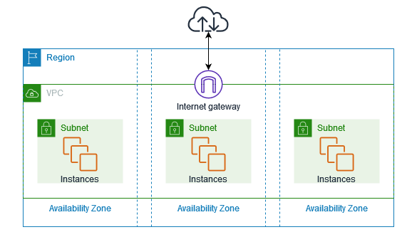

## VPC - Virtual Private Cloud

With a VPC we can configure the network of our cloud, like a real datacenter, using the Scalable Amazon Infrastructure.
The VPC has a subnet in each Availability Zones and an Internet gateway, used to connect the resource and the internet:

The VPC has some features:

- **[The VPC](https://docs.aws.amazon.com/en_us/vpc/latest/userguide/configure-your-vpc.html)**: a virtual network that closely resembles a traditional network
- **[Subnets](https://docs.aws.amazon.com/en_us/vpc/latest/userguide/configure-subnets.html)**: a range of IPs in our VPC. A subnet must reside in a single zone.
- **[IP addressing](https://docs.aws.amazon.com/en_us/vpc/latest/userguide/vpc-ip-addressing.html)**: We can assign IP addresses, both IPv4 and IPv6, for our VPCs and subnets
- **[Routing](https://docs.aws.amazon.com/en_us/vpc/latest/userguide/VPC_Route_Tables.html)**: to determine where traffic from your subnet or gateway is directed
- **[Gateway](https://docs.aws.amazon.com/en_us/vpc/latest/userguide/extend-intro.html) and [endpoints](https://docs.aws.amazon.com/vpc/latest/privatelink/privatelink-access-aws-services.html)**: to access internet and other services inside the VPC
- **[VPN Connections](https://docs.aws.amazon.com/en_us/vpc/latest/userguide/vpn-connections.html)**: used to connect on-premises cloud

