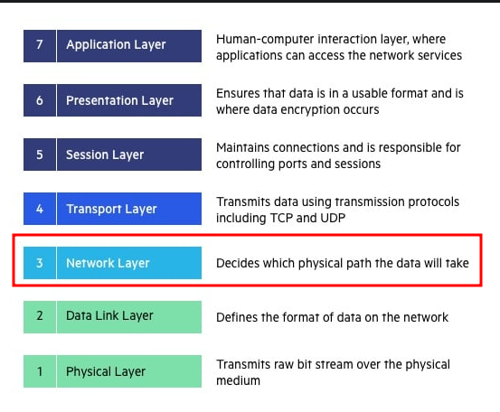

## Scalability

- **Vertical - scale up/down** (analogy: replace a junior operator by a senior operator)
    - Is increase the size of instance: upgrade resources like RAM, CPU, Storage
        - Vertically scaling of an EC2 instance: **from** t2.nano (0.5GB - 1vCPU) **to** u-12tbl.metal ((12.3TB -
          448vCPU))
    - Is limited by hardware (we can't have unlimited RAM and CPUs)
    - Is very common for monolithic applications and database servers
    - Some AWS service can be scaled vertically, like RDS and ElastCache

- **Horizontal - scale out/in** (analogy: increase the number of call center operators)
    - Is increase the number of instances
    - Work with distributed systems
    - Is very common for web applications and another modern applications
    - We can scale horizontally EC2 instances, for example

## High Availability

Run different instances of a service in at least 2 availability zones (data centers) to survive a data center loss.
That can be active and passive:

- **Passive:** that use primary resource and stand by resources. When the primary become unavailable, the secondary are
  promoted to primary.
- **Active:** in that case are resources are used and active, with the load distributed between then using a loading
  balance. If one become unavailable the others ones will receive the load.

## Load balances

### Types of load balance

- **Classic Load Balancer** (v1 - old generation) - 2009 - BLB
  - HTTP, HTTPS, TCP, SSL (secure TCP)
- **Application Load Balancer** (v2 - new generation) - 2016 - ALB
  - HTTP, HTTPS, WebSocket
- Network load Balancer (v2 - new generation) - 2017 - NLB
  - TCP, TLS
- Gateway Load Balance - 2020 GWLB
  - Operates at layer 3 (network Layer of OSI Model) IP Protocol  
    